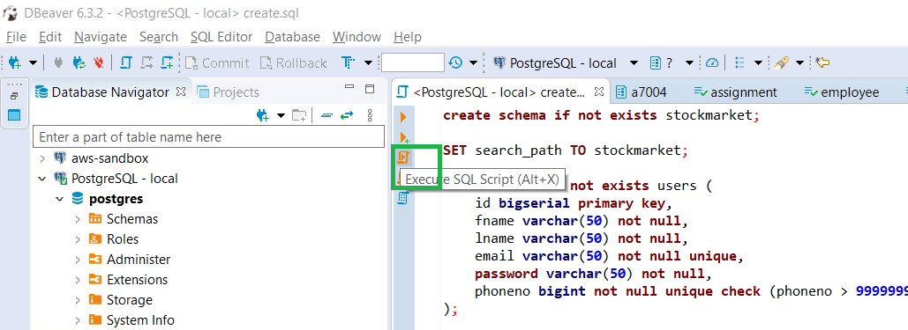

# Stock Market System
## About the Project
The Stock Market System project is a client-server based application that provides multiple functionalities as any conventional stock market or investment banking application. The application supports two user personas, Admin and User. Some of the notable features include buying and selling of stocks at market price or by setting limits, adding and withdrawing funds, displaying the current user portfolio, along with a list of transactions performed and registration of new users.

The admin console helps to manage the stock market by adding new stocks and updating the active time duration of the market. Additionally, the stock market can be simulated via an engine which takes care of order execution and cancellation of expiry.

The project includes three executables:

1. Angular client, which serves the frontend of the application
2. Jetty Server Application serving REST endpoints to interact with the database
3. Executable to randomize stock prices and execute orders.

## Technology Stack
The following technologies were used in building the Stock Market System application:

1. Server - JAVA 8 (JDK 1.8)
2. Java Build - Maven v3.8
3. lient - Angular10
4. Database - PostreSQL v13

## Configuration Steps
1. Database Setup
    - Execute sql-scripts/create.sql script to create schema and table objects in the database.
    -  commented section in the file contains some test entries in the system.
    - To run the script:
    - Via DBeaver: 
        
    - Update the database connection string in config.json
2. Build the JAVA code to generate deployables.
    - Run mvn clean install package in the root folder.
    - Execute the Stock engine by running the command java -jar engine\target\engine-0.1.jar.
    - Start the Jetty server to serve endpoints by running the command java -jar container\target\container-0.1.jar.
3. Build Angular code to start the client server
    - Navigate to the client folder.
    - Run npm install to install node dependencies.
    - Execute npm start to start the node server.

## Just execute it.
Java packages are already built for you. Navigate to the binaries folder to run the engine and server directly.

1. Update the database connection in config.json.
2. Open a command prompt in the binaries folder.
3. Execute java -jar container\container-0.1.jar to run the API Server.
4. Execute java -jar engine\engine-0.1.jar to run the Stocks Engine.